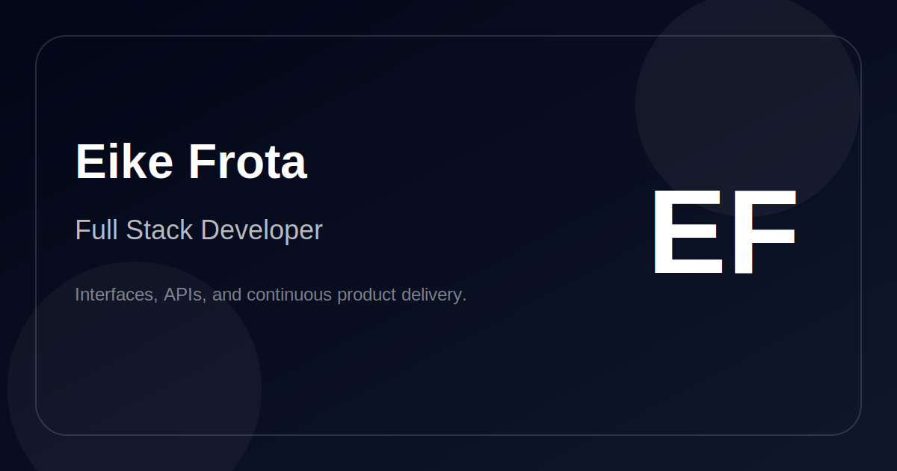

# eikefrotadev




Portfólio pessoal de **Eike Frota**, construído com foco em interface, performance e apresentação clara de projetos, experiência e contato profissional.

## Visão geral

Este projeto usa o **App Router do Next.js** e combina animações sutis, navegação fluida, seções modulares e identidade visual própria para apresentar:

- projetos em destaque;
- stack técnica;
- trajetória profissional e acadêmica;
- depoimentos;
- canais de contato.

## Destaques

- Interface responsiva com experiência pensada para desktop e mobile.
- Navegação com transições e scroll suave.
- Seções organizadas em blocos reutilizáveis.
- Suporte a conteúdo dinâmico via arquivos de dados locais.
- Integração opcional com Supabase para recursos do navegador.
- Metadados preparados para compartilhamento social.

## Stack

- Next.js 16
- React 19
- TypeScript
- Tailwind CSS 4
- Framer Motion
- GSAP
- Lenis
- Supabase
- Cloudflare Wrangler

## Estrutura

- `app/` - rotas, layout, componentes da interface e páginas.
- `app/data/` - conteúdo do site, textos e configuração visual.
- `app/components/` - blocos reutilizáveis do portfólio.
- `lib/` - utilitários e cliente Supabase.
- `public/` - ícones, imagens e assets estáticos.
- `supabase/` - migrations e recursos ligados ao banco.

## Requisitos

- Node.js 20 ou superior
- npm

## Execução local

```bash
npm install
npm run dev
```

Depois, abra `http://localhost:3000`.

## Build

```bash
npm run build
npm run start
```

## Variáveis de ambiente

O projeto funciona sem variáveis de ambiente para navegação básica, mas alguns recursos usam:

```bash
NEXT_PUBLIC_SITE_URL=
NEXT_PUBLIC_SUPABASE_URL=
NEXT_PUBLIC_SUPABASE_PUBLISHABLE_KEY=
```

- `NEXT_PUBLIC_SITE_URL` define a URL base usada nos metadados.
- `NEXT_PUBLIC_SUPABASE_URL` e `NEXT_PUBLIC_SUPABASE_PUBLISHABLE_KEY` habilitam o cliente Supabase no navegador.

## Deploy

O projeto inclui `wrangler.jsonc`, então está preparado para publicação com Cloudflare, se você quiser seguir esse caminho.

## Recursos

- Repositório: [github.com/eikefrota/eikefrotadev](https://github.com/eikefrota/eikefrotadev)
- GitHub: [github.com/eikefrota](https://github.com/eikefrota)
- Currículo: `cv-eikefrota.pdf`

## Licença

Uso pessoal e profissional do portfólio. Se quiser transformar isso em uma licença formal, eu posso adaptar depois.
